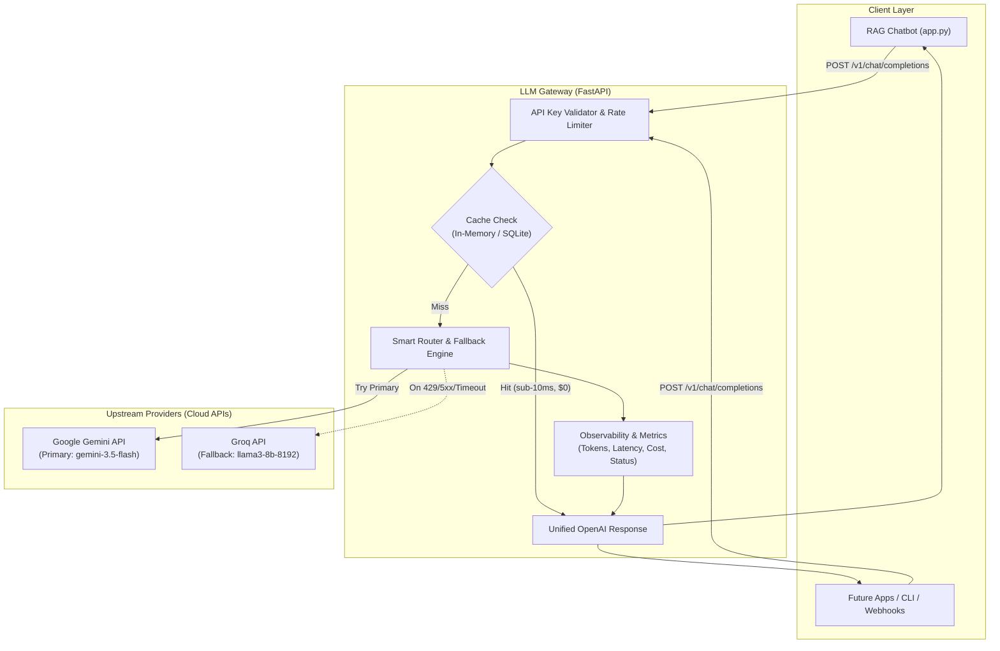

# LLM Gateway: Architectural Specification & Design

## 1. Executive Summary & Objective

The **LLM Gateway** is a resilient, provider-agnostic reverse-proxy service that sits between client applications (such as our RAG Chatbot) and third-party LLM APIs (Google Gemini, Groq, OpenAI, Anthropic).

### Why Build It?
1. **Zero Vendor Lock-in:** The client application speaks standard OpenAI protocol (`/v1/chat/completions`). Swapping or mixing providers requires zero code changes in client apps.
2. **High Availability & Auto-Failover:** If the primary provider (Gemini) encounters a `429 Rate Limit`, `503 Service Unavailable`, or connection timeout, the gateway instantly routes the payload to the fallback provider (Groq) within milliseconds.
3. **Cost & Latency Optimization (Caching):** Duplicate or repeated queries hit a local cache, delivering sub-10ms response times at $0 API cost.
4. **Centralized Observability:** Full visibility into token usage, dollar cost, request latency, and provider error rates in one place.

---

## 2. High-Level System Architecture



---

## 3. Core Modules & Responsibilities

### Module 1: Unified Interface (`/v1/chat/completions`)
* **Standard Payload Acceptance:** Accepts standard OpenAI-formatted JSON:
  ```json
  {
    "model": "auto", 
    "messages": [{"role": "user", "content": "Explain RAG architecture"}],
    "temperature": 0.3,
    "stream": false
  }
  ```
* **Format Normalization:** Translates OpenAI message schemas into Google Gemini (`contents`) or Groq formats internally, and converts responses back into standard OpenAI `ChatCompletionResponse` format.

### Module 2: Smart Router & Fallback Engine
* **Routing Strategy:**
  1. Forward request to Primary Model (`gemini-3.5-flash`).
  2. Set an aggressive timeout threshold (e.g. 5.0 seconds).
  3. Intercept failures: `HTTP 429 (Rate Limit)`, `HTTP 5xx (Server Error)`, or `ReadTimeout`.
  4. Automatically retry request against Secondary Model (`groq/llama3-8b-8192`) without failing the client request.
  5. Include metadata headers in response:
     - `X-Gateway-Provider-Used: groq`
     - `X-Gateway-Fallback-Triggered: true`
     - `X-Gateway-Latency-Ms: 342`

### Module 3: Response Caching
* **Exact-Match Cache:** SHA-256 hash of `(messages + model + temperature)`.
* Avoids calling upstream APIs for repeated prompts.
* Instant sub-10ms response with `X-Gateway-Cache: HIT`.

### Module 4: Token & Cost Accounting Engine
* Tracks:
  - Total prompt tokens vs completion tokens.
  - Estimated spend based on provider pricing tables (e.g., Gemini $0.075 / 1M input tokens vs Groq pricing).
  - Exposes health & stats endpoint: `GET /v1/metrics`.

---

## 4. Proposed Repository Layout

```text
llm-gateway/
├── app/
│   ├── __init__.py
│   ├── main.py                  # FastAPI application entrypoint
│   ├── config.py                # Environment keys (GEMINI_API_KEY, GROQ_API_KEY, GATEWAY_KEYS)
│   ├── api/
│   │   ├── routes.py            # /v1/chat/completions, /v1/models, /v1/metrics
│   │   └── schemas.py           # Pydantic models matching OpenAI spec
│   ├── core/
│   │   ├── router.py            # Routing and fallback orchestration
│   │   ├── cache.py             # Hash-based caching engine
│   │   └── metrics.py           # Token counter, cost estimator, latency logger
│   └── providers/
│       ├── base.py              # Base Provider abstract class
│       ├── gemini.py            # Gemini API client adapter
│       └── groq.py              # Groq API client adapter
├── tests/
│   └── test_gateway.py          # Unit tests verifying fallback & caching
├── requirements.txt
├── .env.example
└── README.md
```

---

## 5. Step-by-Step Implementation Roadmap

| Phase | Milestone | Deliverable |
| :--- | :--- | :--- |
| **Phase 1** | **Core API & Providers** | FastAPI app with `/v1/chat/completions` working with Gemini and Groq adapters. |
| **Phase 2** | **Failover Engine** | Automated fallback on 429/timeout errors; custom tracking headers. |
| **Phase 3** | **Cache & Metrics** | Exact query caching + `/v1/metrics` showing token usage, cost, and latency. |
| **Phase 4** | **RAG Integration** | Updating our RAG Chatbot (`app.py`) to route through our own Gateway. |
